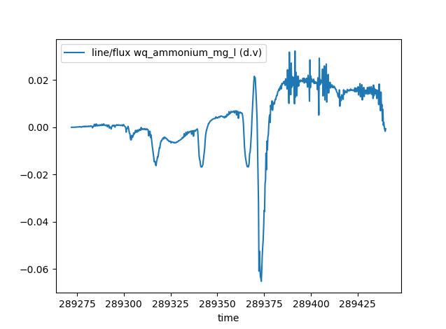

Changelog for 1.2
=================

1.2.0
-----

Release date: 28 August 2026

.. _fv_changelog_entry:

TUFLOW FV
^^^^^^^^^

Support has been added for TUFLOW FV control files. The workflow and data structures are very similar to Classic/HPC with a few minor differences. See :doc:`Working with TUFLOW FV<../examples/working_with_fv>` for examples.

.. _project_creation:

Project Creation
^^^^^^^^^^^^^^^^

.. note::

  This is an experimental feature. This means that the CLI is not considered final and can change in future versions without provision for backward compatibility.

PyTUFLOW now supports project initialisation and creation of a skeleton directory and control files via :doc:`../cli/pytuflow-project`. Alternatively, via the classes :class:`~pytuflow.HPCProject` and :class:`~pytuflow.FVProject`.

.. _flux:

Flux
^^^^

The ability to extract flux from map output results has been added. The flux method takes line(s) and extracts the resulting flux by using the unit flow, or alternatively, the velocity and depth. By default, the :meth:`flux()<pytuflow.XMDF.flux>` method returns the volume of water passing over the line. However, it also has the option to pass in the name of constituent/tracer data types. In these cases, the routine will return the mass flux passing over the line.

The routine is available for map output result formats that contain vector velocity or vector unit flow data. This includes the :class:`XMDF<pytuflow.XMDF>`,
:class:`NCGrid<pytuflow.NCGrid>`, :class:`NCMesh<pytuflow.NCMesh>`, and :class:`CATCHJson<pytuflow.CATCHJson>` classes. Flux calculation from 3D results will include the summation from each vertical layer and will not perform depth averaging.

.. warning::

  The :meth:`flux()<pytuflow.XMDF.flux>` method should be used with care as for most result formats, it will be calculating the flux from an interpolated surface.
  From limited testing on real world models, the :meth:`XMDF.flux()<pytuflow.XMDF.flux>` method will typically estimate flow peak within 5% of the equivalent PO
  flow line. This holds provided there is enough cell resolution across the flow path and SGS is turned off. If SGS is turned on, then it is recommended to use unit flow
  rather than depth and velocity as depth at cell corners can be a poor representation of the flow depth within a cell using an SGS curve. *Note, using unit flow is recommended with SGS on or off, however it is especially important with SGS on*.

The :meth:`flux()<pytuflow.XMDF.flux>` routine can be expensive, mostly due to the number of I⁠/⁠O operations it has to perform (especially if it has to query both depth and velocity). This can be greatly sped up if performing multiple :meth:`flux()<pytuflow.XMDF.flux>` calls on the same result by loading the relevant result types into memory. This can be done using the :meth:`load_into_memory()<pytuflow.XMDF.load_into_memory>` method. See :ref:`load_into_memory` below for more information.

Example:

.. code-block:: pycon

  >>> from pytuflow import XMDF
  >>> res = XMDF('/path/to/hpc-result.xmdf')
  >>> df = res.flux('/path/to/flux-line.shp')
           line/flux (q)
  time
  80.0          0.000000
  82.0          0.000000
  84.0          0.000000
  86.0          0.000000
  88.0          0.000000
  ...                ...
  342.0        13.754197
  344.0        13.498373
  346.0        13.158218
  348.0        13.268435
  350.0        12.799280

  [136 rows x 1 columns]

Flux Integral
^^^^^^^^^^^^^

The ability to extract the flux integral from map output results has been added. The flux integral method takes line(s) and extracts the resulting flux integral by using the unit flow, or alternatively, the velocity and depth. By default, the :meth:`flux_integral()<pytuflow.XMDF.flux_integral>` method returns the volume of water passing over the line integrated over time. However, it also has the option to pass in the name of constituent/tracer data types. In these cases, the routine will return the mass flux passing over the line integrated over time.

.. note::

   Similar caveats and recommendations apply to the :meth:`flux_integral()<pytuflow.XMDF.flux_integral>` method as for the :meth:`flux()<pytuflow.XMDF.flux>` method. See the :ref:`flux` section above for more information.

.. _load_into_memory:

Load into Memory
^^^^^^^^^^^^^^^^

A method to load data into memory has been added to ``MapOutput`` classes e.g. :meth:`XMDF.load_into_memory()<pytuflow.XMDF.load_into_memory>` and :meth:`NCGrid.load_into_memory()<pytuflow.NCGrid.load_into_memory>`. This method loads the entire dataset, including all timesteps, for given data type(s) into memory. This can greatly improve the speed of subsequent queries by removing the need to perform relatively expensive I⁠/⁠O operations.

The process of loading an entire dataset into memory itself can be relatively expensive, however can move all I⁠/⁠O operation costs to a single upfront call. This can then greatly improve the speed of subsequent calls that would usually make a lot of I⁠/⁠O operations, or if making many calls that use I⁠/⁠O operations. A great example of when it could be beneficial to load data into memory upfront is when using the :meth:`flux()<pytuflow.XMDF.flux>` call. The flux method can be more expensive than other extraction methods, especially if it has to query both depth and velocity results. A single flux call will most likely be cheaper than loading a dataset into memory, however it can quickly become beneficial to load into memory up front if making multiple flux calls on the same result.

As an example, a test was carried out by extracting flux on a medium sized XMDF result (~1 GB). The result did not contain unit flow, so both depth and velocity had to be queried to obtain the flux. The :meth:`XMDF.flux()<pytuflow.XMDF.flux>` method took ~2.5 s to execute. Loading both the depth and velocity into memory took ~4.5 s. Subsequent :meth:`XMDF.flux()<pytuflow.XMDF.flux>` calls took ~0.01 s. So in this example case, it would be beneficial to load depth and velocity into memory if extracting flux from two or more locations. This can scale very rapidly, so it is almost always a good idea to load the relevant result types into memory when batch exporting flux from a single result. The exact ratio will vary depending on the results and other variables such as how many cells the flux line intersects and how many timesteps are in the results etc.

Example:

.. code-block:: pycon

  >>> from pytuflow import XMDF
  >>> res = XMDF('/path/to/hpc-result.xmdf')
  >>> res.load_into_memory(['depth', 'vector velocity'])  # make sure to use 'vector velocity' and not 'velocity' for Classic/HPC results
  >>> df = res.flux('/path/to/flux-lines.shp')
  >>> df
        38_1/flux (d.v)  38_2/flux (d.v)  37_1/flux (d.v)  ...  TMR_001/flux (d.v)  SRC_073/flux (d.v)  BCC_077/flux (d.v)
  time                                                      ...
  80.0          0.000000         0.000000         0.000000  ...            0.000000            0.000000            0.000000
  82.0          0.000000         0.000000         0.000000  ...          510.361820            0.000000            0.003746
  84.0          0.000000         0.000000         0.000000  ...        -1140.110520            0.000000           -0.004497
  86.0          0.000000         0.000000         0.000000  ...         -176.114340            0.000000           -0.011052
  88.0          0.000000         0.000000         0.000000  ...         1446.423141            0.000000           -0.032609
  ...                ...              ...              ...  ...                 ...                 ...                 ...
  342.0        13.754197         4.655368         6.469491  ...         3636.175415         3202.797150         3052.134145
  344.0        13.498373         4.438060         6.097150  ...         3243.619695         3208.747937         3048.996453
  346.0        13.158218         4.238195         5.743462  ...         3412.564508         3203.476447         3048.696176
  348.0        13.268435         4.044892         5.398321  ...         3906.436114         3208.706137         3050.309653
  350.0        12.799280         3.846815         5.082798  ...         4107.193577         3197.010855         3050.993464

  [136 rows x 122 columns]

.. note::

  QGIS drivers, specifically the result extraction drivers, are much slower than ``h5py`` and ``netcdf4`` for extracting entire data types results. The same example, which takes ~4.5 s in ``h5py`` takes ~60 s with QGIS drivers. This can still be beneficial if exporting hundreds of flux locations, however it is much better to use a different driver if possible. Note, it is possible to use QGIS for geometry and ``netcdf4`` for result extraction which will negate this problem. In fact, the TUFLOW Viewer V2 (part of the TUFLOW plugin in QGIS) uses this capability and preferences ``netcdf4`` if it is available and QGIS for the geometry.

  This is not intended to disparage QGIS. Libraries such as ``h5py`` have been specifically optimised for getting entire datasets from hdf5 files into Python. So naturally they are very quick at this task. General data extraction in QGIS, given single timesteps, are comparable in speed to ``h5py``.

Add Dataset
^^^^^^^^^^^

A method to add additional datasets has been added to ``Mesh`` classes e.g. :meth:`XMDF.add_dataset()<pytuflow.XMDF.add_dataset>` and :meth:`NCMesh.add_dataset()<pytuflow.NCMesh.add_dataset>`. This routine will take an additional dataset and add it to an existing mesh class as long as they use the same geometry and are of the same type (i.e. a ``.xmdf`` can only be loaded onto an :class:`XMDF<pytuflow.XMDF>` class even if the mesh files share the same geometry).

Adding a dataset to an existing mesh output instance will be cheaper than loading into its own instance since it will not have to load its own mesh geometry (which is typically the slowest part of loading a mesh result). It can also be useful to have result types together in a single result instance as some routines can combine results to give more information. An example of this is the :meth:`flux()<pytuflow.NCMesh.flux>` method which can take additional tracer or constituent data types to provide the resulting mass flux across a line. Results from the TUFLOW FV WQ module is a good example of when this is useful. The WQ module outputs into a separate NetCDF mesh to the hydrodynamic results. The WQ results can be added to the hydrodynamics to combine them to calculate mass flux of various constituents. This is not possible with the WQ results by themselves.

Example:

.. code-block:: pycon

  >>> from pytuflow import NCMesh
  >>> res = NCMesh('/path/to/hydrodynamic-results.nc')
  >>> res.add_dataset('/path/to/wq-results.nc')
  >>> df = res.flux('/path/to/flux-line.shp', 'wq_ammonium_mg_l')
  >>> df
            line/flux wq_ammonium_mg_l (d.v)
  time
  289272.00                          0.000000
  289272.25                          0.000000
  289272.50                          0.000009
  289272.75                          0.000009
  289273.00                          0.000011
  ...                                     ...
  289439.00                          0.002076
  289439.25                         -0.000039
  289439.50                         -0.001020
  289439.75                         -0.001708
  289440.00                         -0.000621

  [673 rows x 1 columns]
  >>> df.plot()
  >>> import matplotlib.pyplot as plt
  >>> plt.show()

.. note::

  This functionality is not intended as a way to quickly reload results onto an already instantiated mesh. The class will return the first instance of a given result type name, which will be the original mesh result. This means that if a dataset is added with data type names that exist already in the mesh instance, it will **not overwrite** the original instance's datasets.

.. note::

  QGIS drivers do not allow a NetCDF mesh to be appended to another NetCDF mesh. PyTUFLOW will allow it and the subsequent behaviour in PyTUFLOW in respect to interacting with the mesh output will be identical regardless of this. However, the mesh geometry will be required to be loaded again so the performance gain will be lost in this situation.

Mesh Dataset
^^^^^^^^^^^^

Mesh results now has a convenience function to obtain a `pyvista.PolyData <https://docs.pyvista.org/api/core/_autosummary/pyvista.polydata/>`_ mesh object. This can be done using :meth:`~pytuflow.XMDF.mesh_dataset`, which will return a geometry based on a dataset such as ``bed level`` or ``water level``.

A ``pyvista.PolyData`` object can be plotted in 3D space using the ``pyvista.Plotter()`` class. Results can be rendered to a movie, or a time slider can be added to allow interaction as well. See the :meth:`~pytuflow.XMDF.mesh_dataset` documentation for examples.

.. video:: ../_static/videos/mesh_dataset_example_4.mp4
    :width: 720
    :align: center
    :caption: Example using pyvista to render an animation with vectors

LP2D
^^^^

The ``2d_lp`` output from TUFLOW Classic/HPC is now supported as a new output class - :class:`LP2D<pytuflow.LP2D>`. This class supports the :meth:`section()<pytuflow.LP2D.section>` method as well as the :meth:`time_series()<pytuflow.LP2D.time_series>` method at automatically generated points at each distance value in the CSV file.

.. video:: ../_static/videos/lp-animation.mp4
    :width: 600
    :align: center

Minor New Features
^^^^^^^^^^^^^^^^^^

- Point and line locations used for result extraction (e.g. :meth:`XMDF.time_series()<pytuflow.XMDF.time_series>` and :meth:`XMDF.section()<pytuflow.XMDF.section>`) will now accept ``shapely`` geometry and ``geopandas.GeoDataFrame`` objects.
- The ``NetCDF4`` driver for XMDF and NetCDF map ouput formats is now more performant when extracting non-contiguous data.
- Added the ability to refresh the tuflow binary locations if the cache (json settings file) is modified by a separate pytuflow process using the :meth:`TuflowBinaries.refresh_from_settings<pytuflow.TuflowBinaries.refresh_from_settings>` method.

Bug Fixes
^^^^^^^^^

- Fixed a bug in the ``MapOutput`` classes where reading in an empty GIS file would cause an unexpected Python error. When an empty GIS file is provided, an exception is still thrown, but gives a more informative message about the issue.
- Fixed a bug where if a ``.prj`` file was used in a TUFLOW projection command, and the accompanying shapefiles were missing (i.e. the ``.shp``, ``.dbf`` etc), then the projection was not read in correctly and produced a warning. This is now fixed and the ``.prj`` is no opened and the projection string is read directly from the file.