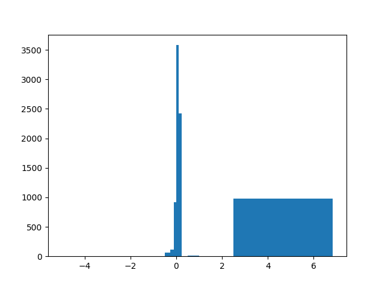

.. _tcf_load_and_run:

Load and Run a TUFLOW Model
===========================

The below example shows how to load a TCF, make an edit, save it, and then run the model. The example below
uses ``EG00_001.tcf`` from the `TUFLOW example models <https://wiki.tuflow.com/TUFLOW_Example_Models>`_.

Loading a TUFLOW Control File (TCF)
-----------------------------------

Loading an existing TUFLOW model can be done very simply using the :class:`TCF<pytuflow.TCF>` class.

.. code-block:: pycon

    >>> from pytuflow import TCF
    >>> tcf = TCF('path/to/EG00_001.tcf')

Navigating the TCF can best be done using :meth:`TCF.find_input()<pytuflow.TCF.find_input>`. This method will return a list of inputs
that match the given filter. For example, finding all SGS related commands:

.. code-block:: pycon

    >>> tcf.find_input('sgs')
    [<SettingInput> SGS == ON, <SettingInput> SGS Sample Target Distance == 0.5]

The :class:`TCF<pytuflow.TCF>` class will return all inputs within the model for the given filter, and not just the TCF file. For example, you can
search for ``"2d_zsh"`` and it will return commands from the TUFLOW Geometry Control File (TGC). There are
also some convenience methods that will return the other control file instances if you want to work with them directly:

.. code-block:: pycon

    >>> tgc = tcf.tgc()
    >>> tbc = tcf.tbc()
    >>> bc_dbase = tcf.bc_dbase()
    >>> materials = tcf.mat_file()
    >>> tgc.find_input('2d_mat')
    [<GisInput> Read GIS Mat == gis\2d_mat_EG00_001_R.shp]

Editing and Updating a TCF
--------------------------

Let's update the map output format command to include the ``NC`` format, as this will be useful later for querying
the results in Python. The first step is to find the relevant command, and then we can update it by setting the
right-hand side (RHS) of the command to include ``"NC"``.

.. code-block:: pycon

    >>> inp = tcf.find_input('map output format')[0]
    >>> print(inp)
    Map Output Format == XMDF TIF

    >>> inp.rhs = f'{inp.rhs} NC' # Append NC to the existing RHS
    >>> print(inp)
    Map Output Format == XMDF TIF NC

The change can be checked in the broader TCF by using :meth:`TCF.preview()<pytuflow.TCF.preview>` to
print a preview of the control file to the console:

.. code-block:: pycon

    >>> tcf.preview()
    ! TUFLOW CONTROL FILE (.TCF) defines the model simulation parameters and directs input from other data sources

    ! MODEL INITIALISATION
    Tutorial Model == ON                                ! This command allows for this model to be simulated without a TUFLOW licence
    GIS Format == SHP									! Specify SHP as the output format for all GIS files
    SHP Projection == ..\model\gis\projection.prj       ! Sets the GIS projection for the TUFLOW Model
    TIF Projection == ..\model\grid\DEM_SI_Unit_01.tif  ! Sets the GIS projection for the ouput grid files
    !Write Empty GIS Files == ..\model\gis\empty        ! This command is commented out. It is only needed for the project establishment

    ! SOLUTION SCHEME
    Solution Scheme == HPC								! Heavily Parallelised Compute, uses adaptive timestepping
    Hardware == GPU										! Comment out if GPU card is not available or replace with "Hardware == CPU"
    SGS == ON											! Switches on Sub-Grid Sampling
    SGS Sample Target Distance == 0.5					! Sets SGS Sample Target Distance to 0.5m

    ! MODEL INPUTS
    Geometry Control File == ..\model\EG00_001.tgc		! Reference the TUFLOW Geometry Control File
    BC Control File == ..\model\EG00_001.tbc			! Reference the TUFLOW Boundary Conditions Control File
    BC Database == ..\bc_dbase\bc_dbase_EG00_001.csv	! Reference the Boundary Conditions Database
    Read Materials File == ..\model\materials.csv  		! Reference the Materials Definition File
    Set IWL == 36.5										! Define an initial 2D water level at start of simulation

    Timestep == 1
    Start Time == 0
    End Time == 3

    ! OUTPUT FOLDERS
    Log Folder == log		  							! Redirects log output files log folder
    Output Folder == ..\results\EG00\	  				! Specifies the location of the 2D result files
    Write Check Files == ..\check\EG00\		  			! Specifies the location of the 2D check files and prefixes them with the .tcf filename

    Map Output Format == XMDF TIF NC                       ! Result file types
    Map Output Data Types == h V d z0					! Specify the output data types
    TIF Map Output Data Types == h						! Specify the output data types for TIF Format
    Map Output Interval == 300  						! Outputs map data every 300 seconds
    TIF Map Output Interval == 0						! Outputs only maximums for grids

Updating control files like this does not make any changes to the control file on disk until
:meth:`TCF.write()<pytuflow.TCF.write>` is called. But we do need to call :meth:`TCF.write()<pytuflow.TCF.write>`
before we can run the updated model. We can overwrite the existing
TCF file if the ``inc`` parameter is set to ``"inplace"``, however in this case, we will save the modified model
to a new file. Since "EG00_002.tcf" is already present in the example models, we will instead save our changes as
"EG00_001a.tcf".

.. code-block:: pycon

    >>> tcf.write(inc='001a')
    <TuflowControlFile> EG00_001a.tcf

.. _setting_up_tuflow_binary_folder:

Running the TUFLOW Model
-------------------------

To run the model, it is useful to provide a location where all the TUFLOW executables are located. This
only needs to be done once and can be done by registering a TUFLOW binary folder. The folder structure should
match the below structure, where the folder name is the TUFLOW version number and the TUFLOW executables are located within
that folder:

.. code-block:: text

   /path/to/tuflow/binaries
     ├── 2025.0.0
     │   ├── TUFLOW_iSP_w64.exe
     │   ├── TUFLOW_iDP_w64.exe
     ├── 2025.1.0
     │   ├── TUFLOW_iSP_w64.exe
     │   ├── TUFLOW_iDP_w64.exe
     ├── 2025.1.2
     │   ├── TUFLOW_iSP_w64.exe
     │   ├── TUFLOW_iDP_w64.exe

.. code-block:: pycon

    >>> from pytuflow import register_tuflow_binary_folder
    >>> register_tuflow_binary_folder('/path/to/tuflow/binaries')

Now we can run the model using the :meth:`TCF.context()<pytuflow.TCF.context>` method and the TUFLOW version name.
The context method is used to pass in what event and scenario combination we want to run.
An empty context is still required even if there are no events or scenarios to run.

.. code-block:: pycon

    >>> tcf_run = tcf.context()
    >>> proc = tcf_run.run('2025.1.2')
    >>> proc.wait() # Wait for the model to finish running

Interrogating the Results
-------------------------

With the ``tcf_run`` instance, we can also get the output folder and output name. With this, we can access the results:

.. code-block:: pycon

    >>> from pytuflow import XMDF
    >>> xmdf_path = tcf_run.output_folder_2d() / f'{tcf_run.output_name()}.xmdf'
    >>> xmdf = XMDF(xmdf_path)

We can extract metadata about the results, such as the result data types and time steps. Metadata can be queried in XMDF files without loading the mesh geometry, which makes it very quick to access. The mesh geometry is only loaded when required, such as when extracting spatial results.

.. code-block:: pycon

    >>> xmdf.data_types()
    ['bed level',
     'max depth',
     'max vector velocity',
     'max velocity',
     'max water level',
     'max z0',
     'depth',
     'vector velocity',
     'velocity',
     'water level',
     'z0',
     'tmax water level']

    >>> xmdf.times()
    [0.0,
    0.08333333333333333,
    0.16666666666666666,
    0.25,
    0.3333333333333333,
    0.41666666666666663,
    0.5,
    ...
    2.833333333333333,
    2.9166666666666665,
    3.0]

Time-series can be extracted from point locations using a coordinate tuple(s) or a GIS point file.

.. code-block:: pycon

    >>> point_shp = 'path/to/2d_po_EG02_010_P.shp'
    >>> df = xmdf.time_series(point_shp, 'water level')
    >>> df
    time       pnt1/water level   pnt2/water level
    0.000000                NaN          36.500000
    0.083333                NaN          36.483509
    0.166667                NaN          36.457958
    0.250000                NaN          36.441391
    0.333333                NaN          36.431271
    0.416667                NaN          36.426140
    0.500000                NaN          36.423336
    0.583333                NaN          36.421467
    0.666667          40.110428          36.420143
    ...                  ...                   ...
    2.833333          42.804726          38.509300
    2.916667          42.793350          38.429859
    3.000000          42.781895          38.342941

We added the ``NC`` map output format to the TCF, so that we also query the results in Python using the
:class:`NCGrid<pytuflow.NCGrid>` class.

.. code-block:: pycon

    >>> from pytuflow import NCGrid
    >>> ncgrid_path = tcf_run.output_folder_2d() / f'{tcf_run.output_name()}.nc'
    >>> ncgrid = NCGrid(ncgrid_path)
    >>> nc_grid.data_types()
    ['water level',
     'depth',
     'velocity',
     'z0',
     'max water level',
     'max depth',
     'max velocity',
     'max z0',
     'tmax water level']
    >>> df = ncgrid.time_series(shp, 'velocity')
    >>> df
              pnt1/velocity  pnt2/velocity
    time
    0.000000            NaN       0.000000
    0.083333            NaN       0.022336
    0.166667            NaN       0.021051
    0.250000            NaN       0.016629
    0.333333            NaN       0.012689
    ...               ...              ...
    2.666667       0.083554       0.447158
    2.750000       0.075304       0.427859
    2.833333       0.066849       0.409600
    2.916667       0.058833       0.393870
    3.000000       0.051204       0.376173

It's also possible to extract the 2D surface from either the XMDF or NC grid results at a given time step. With the surface data, it's possible to perform all sorts of custom analyses such as differences between results (at maximum or any given timestep), statistics, or even visualise the data using packages such as PyVista (which is installed with PyTUFLOW).

An example extracting the maximum water level surface:

.. code-block:: pycon

    >>> df = xmdf.surface('max velocity', time=-1)  # time value can be any value for static datasets such as maximums
    >>> df
                   x            y  value  active
    0      292940.043  6177590.372    0.0   False
    1      292938.904  6177585.504    0.0   False
    2      292934.036  6177586.643    0.0   False
    3      292935.174  6177591.511    0.0   False
    4      292944.912  6177589.234    0.0   False
    ...           ...          ...    ...     ...
    20944  293595.735  6178417.774    0.0   False
    20945  293590.866  6178418.913    0.0   False
    20946  293600.603  6178416.635    0.0   False
    20947  293605.472  6178415.496    0.0   False
    20948  293610.340  6178414.357    0.0   False

We can count the number of cells in each velocity range as defined by the user:

.. code-block:: pycon

    >>> import numpy as np
    >>> bins = [0, 0.5, 1.0, 2.5, 5.0, 20.]
    >>> mask = df['active']  # the active (wet) mask
    >>> counts, _ = np.histogram(df.loc[mask, 'value'], bins)
    >>> counts
    array([4368, 1820, 2030,    5,    0])

The above calculation tells us that there are 5 cells with a maximum velocity between 2.5 m/s and 5.0 m/s and no cells with a maximum velocity above 5.0 m/s.

A similar calculation could be performed on a difference surface to see how many cells exceed certain thresholds. As an example, using results from the example model dataset ``EG16_~s1~_001.tcf`` which contains two scenarios - "EXG" and "D01". It is assumed that both scenarios have been run and the results are available.

First load the results and extract the maximum water level surfaces for both scenarios:

.. code-block:: pycon

    >>> ... # it is assumed you have run both scenarios and the results are available
    >>> exg = XMDF('/path/to/EG16_EXG_001.xmdf')
    >>> d01 = XMDF('/path/to/EG16_D01_001.xmdf')
    >>> exg_wl = exg.surface('max water level', time=-1)
    >>> d01_wl = d01.surface('max water level', time=-1)

We also need to consider inactive cells in either scenario. In this case, we will treat inactive cells as having the same elevation as the bed level. So for this, we also need to extract the surface for the bed level and then set the inactive cells to the bed level:

.. code-block:: pycon

    >>> exg_z = exg.surface('bed level', time=-1)
    >>> d01_z = d01.surface('bed level', time=-1)
    >>> exg_wl.loc[~exg_wl['active'], 'value'] = exg_z.loc[~exg_wl['active'], 'value']
    >>> d01_wl.loc[~d01_wl['active'], 'value'] = d01_z.loc[~d01_wl['active'], 'value']

Now we perform the difference and then count the number of cells that exceed certain thresholds. We will exclude every cell that is inactive in both scenarios so that we are only comparing wet cells in at least one scenario.

.. code-block:: pycon

    >>> mask = exg_wl['active'] | d01_wl['active']
    >>> diff_wl = d01_wl.loc[mask, 'value'] - exg_wl.loc[mask, 'value']
    >>> bins = [min(diff_wl.min() - 0.1, -5), -2.5, -1.0, -0.5, -0.25, -0.1, 0, 0.1, 0.25, 0.5, 1.0, 2.5, max(diff_wl.max(), 5)]
    >>> counts, _ = np.histogram(diff_wl, bins)
    >>> counts
    array([   0,    3,    5,   62,  110,  915, 3580, 2425,    6,   13,    0,
        975])

It's also possible to visualise this with matplotlib:

.. code-block:: pycon

    >>> import matplotlib.pyplot as plt
    >>> plt.hist(diff_wl, bins)
    >>> plt.show()

