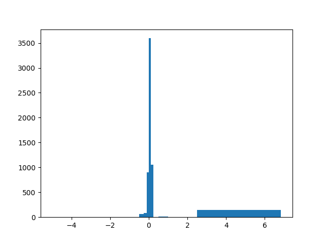

.. _working_with_tuflow_outputs:

Working with TUFLOW Outputs
===========================

Most of the common TUFLOW outputs are supported by ``pytuflow``. This includes: :class:`TPC<pytuflow.TPC>`,
:class:`XMDF<pytuflow.XMDF>`, and :class:`NCGrid<pytuflow.NCGrid>`. Static, single result outputs such as ``TIF`` and ``ASC``
are also supported.

Output classes all derive from the same base class, and as such, share a common interface. This makes the accessing
data from the outputs consistent and mostly format agnostic. There are some slight differences between a time-series
output, which uses IDs, and a map output, which uses coordinates. However, the method names and usage are the same.

The examples below use models from the `TUFLOW Example Model Dataset <https://wiki.tuflow.com/TUFLOW_Example_Models>`_.

TPC
---

The :class:`TPC<pytuflow.TPC>` class can be loaded by initialising the class with the path to the ``.tpc`` file, or
by using the :meth:`TCF.tpc()<pytuflow.TCFRunState.tpc>` method. The below example uses results from ``EG15_001.tcf``.

.. code-block:: pycon

    >>> from pytuflow import TPC
    >>> tpc = TPC('path/to/results/plot/EG15_001.tpc')

or

.. code-block:: pycon

    >>> from pytuflow import TCF
    >>> tcf = TCF('path/to/EG15_001.tcf')
    >>> tpc = tcf.context().tpc()

Result Information
^^^^^^^^^^^^^^^^^^

Information can be obtained from the results, such as the IDs, result types, and the time steps using
:meth:`TPC.ids()<pytuflow.TPC.ids>`, :meth:`TPC.data_types()<pytuflow.TPC.data_types>`, and
:meth:`TPC.times()<pytuflow.TPC.times>` methods respectively.

.. code-block:: pycon

    >>> tpc.ids()
    ['FC01.1_R.1', 'FC01.1_R.2', 'FC01.2_R.1', ..., 'Pipe8', 'Pipe9']

    >>> tpc.data_types()
    ['water level',
     'mass balance',
     'node flow regime',
     'flow',
     'velocity',
     'channel entry losses',
     'channel additional losses',
     'channel exit losses',
     'channel flow regime']

    >>> tpc.times()
    [0.0, 0.016666666666666666, 0.03333333333333333, ..., 2.9833333333333334, 3.0]

These methods also accept an optionals ``filter_by`` argument, which can be used to filter the return data by
a given domain, geometry, data type, or ID. For example, to get the IDs only for 2D domain (PO) results:

.. code-block:: pycon

    >>> tpc.ids(filter_by='po')
    []

In this case, there are no 2D results in the TPC file, so an empty list is returned. We can also filter by geometry,
and we can conbine the geometry filter with the domain filter:

.. code-block:: pycon

    >>> tpc.ids('1d/line')
    ['FC01.1_R', 'FC01.2_R', 'FC04.1_C', 'Pipe0', 'Pipe1', ..., 'Pit8', 'Pit9']

    >>> tpc.ids('channel')
    ['FC01.1_R', 'FC01.2_R', 'FC04.1_C', 'Pipe0', 'Pipe1', ..., 'Pit8', 'Pit9']

The ``"channel"`` filter is a shorthand for ``"1d/line"`` since channels are only a 1D type. A similar shorthand exists
for ``"1d/point"`` and ``"node"``.

Time-Series
^^^^^^^^^^^

Time-series data can be accessed using the :meth:`TPC.time_series()<pytuflow.TPC.time_series>` method:

.. code-block:: pycon

    >>> tpc.time_series('Pipe1', 'flow')
              channel/flow/Pipe1
    time
    0.000000               0.000
    0.016667               0.009
    0.033333               0.040
    0.050000               0.075
    0.066667               0.106
    ...                      ...
    2.933333               0.000
    2.950000               0.000
    2.966667               0.000
    2.983334               0.000
    3.000000               0.000

Since a given ID could exist in multiple domains, for example, a 1D node, a 2D PO point, and a RL point could all
have the same name (TUFLOW allows this), the return DataFrame header will include the domain, result type, and ID
in the column name.

It's also possible to pass in a list of IDs and/or result types to the :meth:`TPC.time_series()<pytuflow.TPC.time_series>`
method to get multiple time-series at once:

.. code-block:: pycon

    >>> tpc.time_series(['Pipe1', 'Pipe2'], ['flow', 'velocity'])
              channel/flow/Pipe1  channel/flow/Pipe2  channel/velocity/Pipe1  channel/velocity/Pipe2
    time
    0.000000               0.000               0.000                   0.000                   0.000
    0.016667               0.009               0.005                   0.510                   0.456
    0.033333               0.040               0.014                   0.740                   0.567
    0.050000               0.075               0.021                   0.875                   0.632
    0.066667               0.106               0.029                   0.966                   0.681
    ...                      ...                 ...                     ...                     ...
    2.933333               0.000               0.000                   0.000                   0.000
    2.950000               0.000               0.000                   0.000                   0.000
    2.966667               0.000               0.000                   0.000                   0.000
    2.983334               0.000               0.000                   0.000                   0.000
    3.000000               0.000               0.000                   0.000                   0.000

Section
^^^^^^^

TPC section data returns a long section from the given channel ID to either the outlet of the connected channels,
or if a second channel ID is provided, to that channel.

.. code-block:: pycon

    >>> tpc.section('Pipe1', 'h', 1.)
        branch_id channel      node  offset        h
    0           0   Pipe1      Pit2     0.0  43.7653
    6           0   Pipe1      Pit3    26.6  43.7654
    1           0  Pipe19      Pit3    26.6  43.7654
    7           0  Pipe19     Pit16    58.3  43.7652
    2           0   Pipe5     Pit16    58.3  43.7652
    8           0   Pipe5     Pit15    94.8  43.7652
    3           0   Pipe6     Pit15    94.8  43.7652
    9           0   Pipe6     Pit14   126.2  43.7654
    4           0  Pipe15     Pit14   126.2  43.7654
    10          0  Pipe15     Pit13   140.0  43.7653
    5           0  Pipe16     Pit13   140.0  43.7653
    11          0  Pipe16  Pipe16.2   212.8  43.7648

In the example above, we use the well known short-hand ``"h"`` for the ``"water level"`` result type. ``pytuflow``
accepts well known short-hands for result types, and it's worth nothing that the column name in the returned DataFrame
will be set based on the result type the user provided. For example, in the example above, ``"h"`` is provided and the
column name is set to ``"h"``. If the user provided ``"water level"``, then column would be set to ``"water level"``.
This is also true for the :meth:`TPC.time_series()<pytuflow.TPC.time_series>`.

A flow trace downstream could branch into multiple channels that go in different directions, the
:meth:`TPC.section()<pytuflow.TPC.section>` method will return data for all branches. The ``branch_id`` column
is used to identify the branch. If the data is used for plotting, the ``branch_id`` can be used to group the data.

XMDF
----

The :class:`XMDF<pytuflow.XMDF>` class is used to read TUFLOW XMDF map outputs (``.xmdf`` files). Other map output formats, such as the NetCDF grid format (:class:`NCGrid<pytuflow.NCGrid>`) and the TUFLOW FV NetCDF mesh output (:class:`NCMesh<pytuflow.NCMesh>`) share similar methods and the examples below are transferable to those formats.

Similar to the :class:`TPC<pytuflow.TPC>` class, the :class:`XMDF<pytuflow.XMDF>` class can be loaded by
initialising the class with the path to the ``.xmdf`` file. Unlike the :class:`TPC<pytuflow.TPC>` class, the
:class:`TCF<pytuflow.TCF>` class does not have a method to load the :class:`XMDF<pytuflow.XMDF>` automatically. The reason for this, is that
the ``.tpc`` output is always created by TUFLOW, whereas the ``.xmdf`` output is optional. It is very easy to
obtain the path to the ``.xmdf`` file from your TUFLOW model. The example below uses results from
``EG00_001.tcf``.

.. code-block:: pycon

    >>> from pytuflow import TCF, XMDF
    >>> tcf = TCF('path/to/EG00_001.tcf')
    >>> xmxdf_path = tcf.context().output_folder_2d() / f'{tcf.context().output_name()}.xmdf'
    >>> xmdf = XMDF(xmxdf_path)

Result Information
^^^^^^^^^^^^^^^^^^

Information, such as result types and time steps, can be obtained using :meth:`XMDF.data_types()<pytuflow.XMDF.data_types>`
and :meth:`XMDF.times()<pytuflow.XMDF.times>` methods respectively.

.. code-block:: pycon

    >>> xmdf.data_types()
    ['water level',
     'depth',
     'velocity',
     'z0',
     'max water level',
     'max depth',
     'max velocity',
     'max z0',
     'tmax water level']

    >>> xmdf.times()
    [0.0, 0.08333333333333333, 0.16666666666666666, ..., 2.9166666666666665, 3.0]

It's possible to filter the return data by whether the result type is ``temporal/static`` and/or ``scalar/vector``.

.. code-block:: pycon

    >>> xmdf.data_types(filter_by='temporal')
    ['water level', 'depth', 'velocity', 'z0']

    >>> xmdf.data_types(filter_by='vector')
    ['velocity', 'max velocity']

    >>> xmdf.data_types(filter_by='static/scalar')
    ['max water level', 'max depth', 'max z0', 'tmax water level']

Time-Series
^^^^^^^^^^^

The :meth:`XMDF.time_series()<pytuflow.XMDF.time_series>` method is very similar to the :meth:`TPC.time_series()<pytuflow.TPC.time_series>`
method, except that it takes a spatial location (coordinates) instead of an ID. The coordinates can be a
tuple ``(x, y)`` coordinate, a WKT string ``"POINT (x y)"``, or a file path to a GIS point file (e.g. ``.shp``) containing one or more points.

In the example below, we will use the ``gis\2d_po_EG02_010_P.shp`` file from the TUFLOW example model dataset.

.. code-block:: pycon

    >>> xmdf.time_series('./gis/2d_po_EG02_010_P.shp', 'water level')
              PO_01/water level  PO_02/water level
    time
    0.000000                NaN          36.500000
    0.083333                NaN          36.483509
    0.166667                NaN          36.457958
    0.250000                NaN          36.441391
    0.333333                NaN          36.431271
    0.416667                NaN          36.426140
    0.500000                NaN          36.423336
    0.583333                NaN          36.421467
    0.666667          40.110428          36.420143
    ...                  ...                   ...
    2.833333          42.804726          38.509300
    2.916667          42.793350          38.429859
    3.000000          42.781895          38.342941

Section
^^^^^^^

The :meth:`XMDF.section()<pytuflow.XMDF.section>` extracts a cross-section from the results at a given time,
from a given polyline. The polyline can be a series of coordinates, a WKT string, or a path to a GIS polyline file.

The example below uses the ``gis\2d_po_EG02_010_L.shp`` file from the TUFLOW example model dataset.

.. code-block:: pycon

    >>> xmdf.section('./gis/2d_po_EG02_010_L.shp', 'water level', 1.)
            PO_01                   PO_02
               offset water level      offset water level
        0    0.000000         NaN    0.000000         NaN
        1    0.223653         NaN    0.378194         NaN
        2    2.947713         NaN    3.266278         NaN
        3    7.948157         NaN    8.285645         NaN
        4   12.948420         NaN   12.927794         NaN
        ..        ...         ...         ...         ...
        69        NaN         NaN  309.448305         NaN
        70        NaN         NaN  314.467647         NaN
        71        NaN         NaN  319.486920         NaN
        72        NaN         NaN  323.888631         NaN
        73        NaN         NaN  325.780984         NaN

*Note*, that the returned DataFrame does not use a common index, as the section data comes from different polylines.
The printed DataFrame is truncated and does contain valid values within the truncated section. The first PO line ``PO_01``
is shorter than the second PO line ``PO_02``, so the last rows are ``NaN`` for the first PO line.

Surface
^^^^^^^

It's also possible to extract the 2D surface from map outputs at a given time step. With the surface data, it's possible to perform all sorts of custom analyses such as differences between results such as statistics, or histograms.

An example extracting the maximum velocity surface:

.. code-block:: pycon

    >>> df = xmdf.surface('max velocity', time=-1)  # time value can be any value for static datasets such as maximums
    >>> df
                   x            y  value  active
    0      292940.043  6177590.372    0.0   False
    1      292938.904  6177585.504    0.0   False
    2      292934.036  6177586.643    0.0   False
    3      292935.174  6177591.511    0.0   False
    4      292944.912  6177589.234    0.0   False
    ...           ...          ...    ...     ...
    20944  293595.735  6178417.774    0.0   False
    20945  293590.866  6178418.913    0.0   False
    20946  293600.603  6178416.635    0.0   False
    20947  293605.472  6178415.496    0.0   False
    20948  293610.340  6178414.357    0.0   False

We can count the number of cells in each velocity range as defined by the user:

.. code-block:: pycon

    >>> import numpy as np
    >>> bins = [0, 0.5, 1.0, 2.5, 5.0, 20.]
    >>> mask = df['active']  # the active (wet) mask
    >>> counts, _ = np.histogram(df.loc[mask, 'value'], bins)
    >>> counts
    array([4368, 1820, 2030,    5,    0])

The above calculation tells us that there are 5 cells with a maximum velocity between 2.5 m/s and 5.0 m/s and no cells with a maximum velocity above 5.0 m/s.

Surface Differences
^^^^^^^^^^^^^^^^^^^

A similar calculation could be performed on a difference surface to see how many cells exceed certain thresholds. As an example, using results from the example model dataset ``EG16_~s1~_001.tcf`` which contains two scenarios - ``EXG`` and ``D01``. It is assumed that both scenarios have been run and the results are available.

First load the results and extract the maximum water level surfaces for both scenarios. Because we are working with maximum water level, which is a static result, we can use any time value when extracting the surface. Here we use ``time=-1`` to indicate that it is a static result.

.. code-block:: pycon

    >>> exg = XMDF('/path/to/EG16_EXG_001.xmdf')
    >>> d01 = XMDF('/path/to/EG16_D01_001.xmdf')

    >>> exg_wl = exg.surface('max water level', time=-1)
    >>> d01_wl = d01.surface('max water level', time=-1)

We also need to consider inactive cells in either scenario. In this case, we will treat inactive cells as having the same elevation as the bed level. So for this, we also need to extract the surface for the bed level and then set the inactive cells to the bed level:

.. code-block:: pycon

    >>> exg_z = exg.surface('bed level', time=-1)
    >>> d01_z = d01.surface('bed level', time=-1)

    >>> exg_wl.loc[~exg_wl['active'], 'value'] = exg_z.loc[~exg_wl['active'], 'value']
    >>> d01_wl.loc[~d01_wl['active'], 'value'] = d01_z.loc[~d01_wl['active'], 'value']

Now we perform the difference and then count the number of cells that exceed certain thresholds. We will exclude every cell that is inactive in both scenarios so that we are only comparing wet cells in at least one scenario.

.. code-block:: pycon

    >>> mask = exg_wl['active'] | d01_wl['active'] # combined mask

    >>> diff_wl = d01_wl.loc[mask, 'value'] - exg_wl.loc[mask, 'value'] # difference

    >>> bins = [
          min(diff_wl.min() - 0.1, -5),
          -2.5, -1.0, -0.5, -0.25, -0.1, 0, 0.1, 0.25, 0.5, 1.0, 2.5,
          max(diff_wl.max(), 5)
    ]

    >>> counts, _ = np.histogram(diff_wl, bins)
    >>> counts
    array([   0,    3,    5,   62,  110,  915, 3580, 2425,    6,   13,    0,
        975])

It's also possible to visualise this with matplotlib:

.. code-block:: pycon

    >>> import matplotlib.pyplot as plt
    >>> plt.hist(diff_wl, bins)
    >>> plt.show()

.. image:: ../assets/images/simple_histogram_example.png
    :alt: Histogram of water level differences
    :align: center

In the above histogram, we can see that there are a significant number of cells with differences above 2 metres. These may be on the development site and should not be considered an impact. We can mask these areas by converting the returned DataFrame to a GeoDataFrame and masking the area using a polygon shapefile of the development site.

.. code-block:: pycon

    >>> import geopandas as gpd
    >>> gdf = gpd.GeoDataFrame(
          diff_wl,
          geometry=gpd.points_from_xy(exg_wl.loc[mask, 'x'], exg_wl.loc[mask, 'y'])
    )
    >>> shp = gpd.read_file('/path/to/site_boundary.shp')
    >>> inters = gdf.geometry.interesects(shp.geometry.iloc[0])  # assuming only one polygon in shapefile
    >>> masked_diff = diff_wl.loc[~inters]
    >>> plt.hist(masked_diff, bins)
    >>> plt.show()

