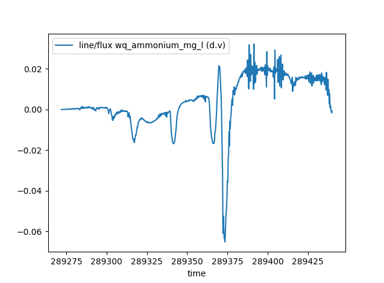

.. pytuflow documentation master file, created by
   sphinx-quickstart on Fri May 17 17:29:22 2024.
   You can adapt this file completely to your liking, but it should at least
   contain the root `toctree` directive.

Welcome to PyTUFLOW's documentation!
====================================

**PyTUFLOW** is a library that acts as an API for your TUFLOW model. It allows easy interaction with the model results,
contains a number of useful utilities for building TUFLOW models, and contains some useful parsers for files within the
TUFLOW eco-system.

Check out the :doc:`usage` section for further information, including how to :ref:`install <installation>` the project.

.. toctree::
   :maxdepth: 1
   :caption: Contents:

   usage
   api
   examples

Changelog
---------

1.2.0
"""""

Release date: XX XXX 2026

Flux
^^^^

The ability to extract flux from map output results has been added. The flux method takes line(s) and extracts the resulting flux by using the unit flow, or alternatively, the velocity and depth. By default, the :meth:`flux()<pytuflow.XMDF.flux>` method returns the volume of water passing over the line. However, it also has the option to pass in the name of constituent/tracer data types. In these cases, the routine will return the mass flux passing over the line.

The routine is available for map output result formats that contain vector velocity or vector unit flow data. This includes the :class:`XMDF<pytuflow.XMDF>`,
:class:`NCGrid<pytuflow.NCGrid>`, :class:`NCMesh<pytuflow.NCMesh>`, and :class:`CATCHJson<pytuflow.CATCHJson>` classes. Flux calculation from 3D results will include the summation from each vertical layer and will not perform depth averaging.

.. warning::

  The :meth:`flux()<pytuflow.XMDF.flux>` method should be used with care as for most result formats, it will be calculating the flux from an interpolated surface.
  From limited testing on real world models, the :meth:`XMDF.flux()<pytuflow.XMDF.flux>` method will typically estimate flow peak within 5% of the equivalent PO
  flow line. This is provided there is enough cell resolution across the flow path and SGS is turned off. If SGS is turned on, then it is recommended to use unit flow
  rather than depth and velocity as depth at cell corners can be a poor representation of the flow depth within a cell using an SGS curve. *Note, using unit flow is recommended with SGS on or off, however it is especially important with SGS on*.

The :meth:`flux()<pytuflow.XMDF.flux>` routine can be expensive, mostly due to the number of I⁠/⁠O operations it has to perform (especially if it has to query both depth and velocity). This can be greatly sped up if performing multiple :meth:`flux()<pytuflow.XMDF.flux>` calls on the same result by loading the relevant result types into memory. This can be done using the :meth:`load_into_memory()<pytuflow.XMDF.load_into_memory>` method. See :ref:`load_into_memory` below for more information.

Example:

.. code-block:: pycon

  >>> from pytuflow import XMDF
  >>> res = XMDF('/path/to/hpc-result.xmdf')
  >>> df = res.flux('/path/to/flux-line.shp')
           line/flux (q)
  time
  80.0          0.000000
  82.0          0.000000
  84.0          0.000000
  86.0          0.000000
  88.0          0.000000
  ...                ...
  342.0        13.754197
  344.0        13.498373
  346.0        13.158218
  348.0        13.268435
  350.0        12.799280

  [136 rows x 1 columns]

.. _load_into_memory:

Load into Memory
^^^^^^^^^^^^^^^^

A method to load data into memory has been added to ``MapOutput`` classes e.g. :meth:`XMDF.load_into_memory()<pytuflow.XMDF.load_into_memory>` and :meth:`NCGrid.load_into_memory()<pytuflow.NCGrid.load_into_memory>`. This method loads the entire dataset, including all timesteps, for given data type(s) into memory. This can greatly improve the speed of subsequent queries by removing the need to perform relatively expensive I⁠/⁠O operations.

The process of loading an entire dataset into memory itself can be relatively expensive, however can move all I⁠/⁠O operation costs to a single upfront call. This can then greatly improve the speed of subsequent calls that would usually make a lot of I⁠/⁠O operations, or if making many calls that use I⁠/⁠O operations. A great example of when it could be beneficial to load data into memory upfront is when using the :meth:`flux()<pytuflow.XMDF.flux>` call. The flux method can be more expensive than other extraction methods, especially if it has to query both depth and velocity results. A single flux call will mostly likely be cheaper than loading a dataset into memory, however it can quickly become beneficial to load into memory up front if making multiple flux calls on the same result.

As an example, a test was carried out by extracting flux on a medium sized XMDF result (~1 GB). The result did not contain unit flow, so both depth and velocity had to be queried to obtain the flux. The :meth:`XMDF.flux()<pytuflow.XMDF.flux>` method took ~2.5 s to execute. Loading both the depth and velocity into memory took ~4.5 s. Subsequent :meth:`XMDF.flux()<pytuflow.XMDF.flux>` calls took ~0.01 s. So in this example case, it would be beneficial to load depth and velocity into memory if extracting flux from two or more locations. This can scale very rapidly, so it is almost always a good idea to load the relevant result types into memory when batch exporting flux from a single result. The exact ratio will vary depending on the results and other variables such as how many cells the flux line intersects and how many timesteps are in the results etc.

Example:

.. code-block:: pycon

  >>> from pytuflow import XMDF
  >>> res = XMDF('/path/to/hpc-result.xmdf')
  >>> res.load_into_memory(['depth', 'vector velocity'])  # make sure to use 'vector velocity' and not 'velocity' for Classic/HPC results
  >>> df = res.flux('/path/to/flux-lines.shp')
  >>> df
        38_1/flux (d.v)  38_2/flux (d.v)  37_1/flux (d.v)  ...  TMR_001/flux (d.v)  SRC_073/flux (d.v)  BCC_077/flux (d.v)
  time                                                      ...
  80.0          0.000000         0.000000         0.000000  ...            0.000000            0.000000            0.000000
  82.0          0.000000         0.000000         0.000000  ...          510.361820            0.000000            0.003746
  84.0          0.000000         0.000000         0.000000  ...        -1140.110520            0.000000           -0.004497
  86.0          0.000000         0.000000         0.000000  ...         -176.114340            0.000000           -0.011052
  88.0          0.000000         0.000000         0.000000  ...         1446.423141            0.000000           -0.032609
  ...                ...              ...              ...  ...                 ...                 ...                 ...
  342.0        13.754197         4.655368         6.469491  ...         3636.175415         3202.797150         3052.134145
  344.0        13.498373         4.438060         6.097150  ...         3243.619695         3208.747937         3048.996453
  346.0        13.158218         4.238195         5.743462  ...         3412.564508         3203.476447         3048.696176
  348.0        13.268435         4.044892         5.398321  ...         3906.436114         3208.706137         3050.309653
  350.0        12.799280         3.846815         5.082798  ...         4107.193577         3197.010855         3050.993464

  [136 rows x 122 columns]

.. note::

  QGIS drivers, specifically the result extraction drivers, are much slower than ``h5py`` and ``netcdf4`` for extracting entire data types results. The same example, which takes ~4.5 s in ``h5py`` takes ~60 s with QGIS drivers. This can still be beneficial if exporting hundreds of flux locations, however it is much better to use a different driver if possible. Note, it is possible to use QGIS for geometry and ``netcdf4`` for result extraction which will negate this problem. In fact, the TUFLOW Viewer V2 (part of the TUFLOW plugin in QGIS) uses this capability and preferences ``netcdf4`` if it is available and QGIS for the geometry.

  This is not intended to disparage QGIS. Libraries such as ``h5py`` have been specifically optimised for getting entire datasets from hdf5 files into Python. So naturally they are very quick at this task. General data extraction in QGIS, given single timesteps, are comparable to speeds in ``h5py``.

Add Dataset
^^^^^^^^^^^

A method to add additional datasets has been added to ``Mesh`` classes e.g. :meth:`XMDF.add_dataset()<pytuflow.XMDF.add_dataset>` and :meth:`NCMesh.add_dataset()<pytuflow.NCMesh.add_dataset>`. This routine will take an additional dataset and add it to an existing mesh class as long as they use the same geometry and are of the same type (i.e. a ``.xmdf`` can only be loaded onto an :class:`XMDF<pytuflow.XMDF>` class even if the mesh files share the same geometry). 

Adding a dataset to an existing mesh output instance will be cheaper than loading into its own instance since it will not have to load its own mesh geometry (which is typically the slowest part of loading a mesh result). It can also be useful to have result types together in a single result instance as some routines can combine results to give more information. An example of this is the :meth:`flux()<pytuflow.NCMesh.flux>` method which can take additional tracer or constituent data types to provide the resulting mass flux across a line. Results from the TUFLOW FV WQ module is a good example of when this is useful. The WQ module outputs into a separate NetCDF mesh to the hydrodynamic results. The WQ results can be added to the hydrodynamics to combine them to calculate mass flux of various constituents. This is not possible with the WQ results by themselves.

Example:

.. code-block:: pycon

  >>> from pytuflow import NCMesh
  >>> res = NCMesh('/path/to/hydrodynamic-results.nc')
  >>> res.add_dataset('/path/to/wq-results.nc')
  >>> df = res.flux('/path/to/flux-line.shp', 'wq_ammonium_mg_l')
  >>> df
            line/flux wq_ammonium_mg_l (d.v)
  time
  289272.00                          0.000000
  289272.25                          0.000000
  289272.50                          0.000009
  289272.75                          0.000009
  289273.00                          0.000011
  ...                                     ...
  289439.00                          0.002076
  289439.25                         -0.000039
  289439.50                         -0.001020
  289439.75                         -0.001708
  289440.00                         -0.000621

  [673 rows x 1 columns]
  >>> df.plot()
  >>> import matplotlib.pyplot as plt
  >>> plt.show()

.. note::

  This functionality is not intended as a way to quickly reload results onto an already instantiated mesh. The class will return the first instance of a given result type name, which will be the original mesh result. This means that if a dataset is added with data type names that exist already in the mesh instance, it will **not overwrite** the original instance's datasets.

.. note::

  QGIS drivers do not allow a NetCDF mesh to be appended to another NetCDF mesh. PyTUFLOW will allow it and the subsequent behaviour in PyTUFLOW in respect to interacting the the mesh output will be identical regardless of this. However, the mesh geometry will be required to be loaded again so the performance gain will be lost in this situation.

Minor New Features
^^^^^^^^^^^^^^^^^^

- Point and line locations used for result extraction (e.g. :meth:`XMDF.time_series()<pytuflow.XMDF.time_series>` and :meth:`XMDF.section()<pytuflow.XMDF.section>`) will now accept ``shapely`` geometry and ``geopandas.GeoDataFrame`` objects.
- The ``NetCDF4`` driver for XMDF and NetCDF map ouput formats is now more performant when extracting non-contiguous data.

Bug Fixes
^^^^^^^^^

- Fixed a bug in the ``MapOutput`` classes where reading in an empty GIS file would cause an unexpected Python error. When an empty GIS file is provided, an exception is still thrown, but gives a more informative message about the issue.

1.1.1
"""""

Release date: 8 April 2026

- Fixed a bug in the :class:`TPC<pytuflow.TPC>` class when the 2D results included structure groups. The ``"u/s structure water level"`` and ``"d/s structure water level"`` data types were causing issues with PyTUFLOW's handling of the forward slash ``"/"`` character. This character has a special meaning in PyTUFLOW for separating context in the location/filter strings. This issue caused PyTUFLOW to not be able to plot from these data types. The ``"/"`` character is now replaced with a dash ``"-"`` character for these data types to avoid this issue.
- Fixed a bug in the :class:`TuflowBinaries<pytuflow.TuflowBinaries>` class where binaries found from installed locations from the Window MSI installation were incorrectly pointing at the folder rather than the ``.exe`` file.
- Fixed a bug when loading a TUFLOW-SWMM output with the :class:`GPKG1D()<pytuflow.GPKG1D>` class where the results would fail to load due to channels that contained all ``NaN`` values for a given data type. This caused a loading error when the class tried to calculate the time of maximum for that data type.
- Fixed a regression bug in the :class:`TCF<pytuflow.TCF>` class which would cause an error when encountering an absolute file path for folder inputs (e.g. ``Write Check Files == C:\TUFLOW\Model\Check\``).
- Fixed a regression bug in the :class:`TCF<pytuflow.TCF>`, and other control file classes, when a GPKG input contained a variable in the layer name (e.g. ``Read GIS PO == database.gpkg >> 2d_po_<<~s~>>_L``).
- Fixed a bug when loading a :class:`TCF<pytuflow.TCF>` file that contained an ``MI Projection == CoordSys...`` style command.

1.1
"""

Release date: 26 March 2026

Removed QGIS Dependency Requirement
^^^^^^^^^^^^^^^^^^^^^^^^^^^^^^^^^^^

QGIS is no longer required for extracting data from mesh outputs. Prior to ``v1.1``, PyTUFLOW required a QGIS environment to be able to extract data from mesh outputs (e.g. :meth:`XMDF.time_series()<pytuflow.XMDF.time_series>`, :meth:`XMDF.section()<pytuflow.XMDF.section>` etc). In place of QGIS, PyTUFLOW will use `PyVista <https://docs.pyvista.org>`_ for mesh geometry operations and either `NetCDF4 <https://unidata.github.io/netcdf4-python/>`_ or `h5py <https://www.h5py.org/>`_ for extracting the dataset values (h5py is typically a little faster and will be preferred by PyTUFLOW).

This change comes with speed improvements for loading mesh outputs as well as significant speed improvements when extracting data along a linestring (e.g. for :meth:`XMDF.section()<pytuflow.XMDF.section>` and :meth:`XMDF.curtain()<pytuflow.XMDF.curtain>` methods). See the :ref:`Optimised Mesh Outputs<v1.1_optimisations>` section for more details.

Removed GDAL Dependency Requirement
^^^^^^^^^^^^^^^^^^^^^^^^^^^^^^^^^^^

GDAL is no longer required for GIS operations or data extraction. PyTUFLOW now uses `GeoPandas <https://geopandas.org>`_ for vector datasets and `Rasterio <https://rasterio.readthedocs.io>`_ for raster datasets. This change simplifies the installation process for PyTUFLOW.

GDAL can still be used in lieu of GeoPandas and Rasterio, however GeoPandas and Rasterio will be preferred by PyTUFLOW if they are available in the Python environment.

New Methods for Map Output Classes
^^^^^^^^^^^^^^^^^^^^^^^^^^^^^^^^^^

New methods have been added to the map output classes (:meth:`XMDF<pytuflow.XMDF>`, :meth:`NCMesh<pytuflow.NCMesh>`, :meth:`DAT<pytuflow.DAT>`, :meth:`NCGrid<pytuflow.NCGrid>`, :meth:`CATCHJson<pytuflow.CATCHJson>`):

- :meth:`data_point()<pytuflow.XMDF.data_point>`: Extract a single data point at a given time and location.
- :meth:`maximum()<pytuflow.XMDF.maximum>`: Extract the maximum value over the entire simulation for a given location or set of locations.
- :meth:`minimum()<pytuflow.XMDF.minimum>`: Extract the minimum value over the entire simulation for a given location or set of locations.
- :meth:`surface()<pytuflow.XMDF.surface>`: Extract a 2D surface at a given time and data type.

.. _v1.1_optimisations:

Optimised Mesh Outputs
^^^^^^^^^^^^^^^^^^^^^^

New mesh drivers have been added for handling mesh outputs with QGIS libraries (nominally called "QGIS drivers") and without QGIS libraries (nominally called "Python drivers").

The best drivers will be chosen automatically based on the available libraries in your Python environment, but it is also possible to specify which drivers to use when initialising the output class. It is recommended to use the Python drivers where possible for speed improvements and to reduce the complexity of the Python environment. Python drivers also offer faster initialisation times since the mesh geometry is not loaded until it is required for data extraction.

The tables below summarise benchmarking results for the different drivers. The table is for comparison purposes only and the actual times will depend on the model size, computer hardware, and Python environment.

.. csv-table:: Benchmarking information
  :file: assets/tables/v1.1_benchmarking_specs.csv
  :header-rows: 1

\* Section() line cell count relates to the last table

.. csv-table:: Load times (XMDF) - including loading mesh geometry and generating spatial indexing (seconds)
  :file: assets/tables/v1.1_benchmarking_loading.csv
  :header-rows: 1

.. csv-table:: Single data point extraction (seconds)
  :file: assets/tables/v1.1_benchmarking_data_point.csv
  :header-rows: 1

.. csv-table:: Section extraction (seconds)
  :file: assets/tables/v1.1_benchmarking_section.csv
  :header-rows: 1

\* Did not finish within 30 minutes.

\*\* "New QGIS Drivers" refers to optimisations made to the Python code in PyTUFLOW for using QGIS and does not refer to any changes in QGIS itself.

Optimised NetCDF Grid Output
^^^^^^^^^^^^^^^^^^^^^^^^^^^^

The :class:`NCGrid<pytuflow.NCGrid>` output class has been optimised for speed when extracting data. In particular, the :meth:`NCGrid.section()<pytuflow.NCGrid.section>` has been optimised when finding the cells along a linestring. The :meth:`NCGrid.section()<pytuflow.NCGrid.section>` method is now ~2x faster than in previous versions.

Some data caching has also been implemented for faster repeated calls to the same data type.

Optimised TPC Output
^^^^^^^^^^^^^^^^^^^^

Significant speed up for loading TPC results from a model that contains a lot of channels (in the order of > 500). For example, a test was run on a model that contained approximately 5,000 pipes, and the load time went from 15 seconds to < 1 second.

Installed TUFLOW Locations
^^^^^^^^^^^^^^^^^^^^^^^^^^

PyTUFLOW will now automatically find installed TUFLOW versions. That is, versions of TUFLOW installed via the ``.msi`` installer on Windows or the ``.deb`` and ``.rpm`` packages on Linux. This means that users can use the :class:`TCFRunState.run()<pytuflow.TCFRunState.run>` method with installed versions of TUFLOW without needing to register the TUFLOW binary locations.

Minor New Features
^^^^^^^^^^^^^^^^^^

- Added Flood Modeller DAT cross-section output class - :class:`DATCrossSections<pytuflow.DATCrossSections>`. This is essentially a wrapper around the ``FmCrossSectionDatabaseDriver`` class and allows users to interact with Flood Modeller DAT files in an easier way via the ``Output`` class methods - e.g. :meth:`ids()<pytuflow.DATCrossSections.ids>`, :meth:`data_types()<pytuflow.DATCrossSections.data_types>`, :meth:`section()<pytuflow.DATCrossSections.section>`.
- Added :attr:`has_reference_time<pytuflow.XMDF.has_reference_time>` property to all output classes. This property holds whether the loaded output contains an explicit reference time. The :attr:`reference_time<pytuflow.XMDF.reference_time>` property will always return a value and as a consequence cannot be used for this purpose.
- Curtain plots will now return a fourth column for vector results that contain the vector projected onto the direction of the input linestring.
- ``direction_of_velocity`` and ``direction_of_unit_flow`` are now recognised as separate scalar datasets. Previously, these would be assumed to be combined with the velocity and unit flow magnitude datasets respectively and then treated as a vector dataset. This change allows the datasets to be treated separately and the available datasets align more closely with what is actually in the NetCDF file. This also allows users to plot the direction datasets as scalar datasets.
- Calculated offsets in the :meth:`section()<pytuflow.NCMesh.section>` and :meth:`curtain()<pytuflow.NCMesh.curtain>` methods will now return ellipsoid distances if the results are using spherical coordinates.
- :meth:`CATCHJson.time_series()<pytuflow.CATCHJson.time_series>` and :meth:`CATCHJson.profile()<pytuflow.CATCHJson.profile>` methods can now return results from multiple locations if the locations fall within different result domains (e.g. one point could sit within the TUFLOW HPC catchment result and the other within the 2D receiving TUFLOW FV receiving result).
- Additional context can now be added when extracting results from the :class:`TPC<pytuflow.TPC>` result class. For example, when extracting :meth:`time_series()<pytuflow.TPC.time_series>` results, it's possible to add additional context such as the domain (e.g. ``"channel"`` or ``"rl"``) by adding this context to the location with a ``"/"`` delimiter e.g. ``"rl/flow_line"``.
- Comments in material files are now kept in the resulting DataFrame.
- Adds a :attr:`line_number<pytuflow.SettingInput.line_number>` property to the :class:`Input<pytuflow.SettingInput>` class that represents the line in the control file the input command is on.
- Adds a :meth:`Scope.pretty_print()<pytuflow.Scope.pretty_print>` method.

Bug Fixes
^^^^^^^^^

- ``"water depth"`` data type is now correctly recognised as ``"depth"`` .
- Max data types now correctly return maximum water surface elevation for 2D results for the :meth:`curtain()<pytuflow.XMDF.curtain>` method.
- Fixed a bug where ``"vector"`` was being removed from the data type ``"vector velocity"`` or ``"max vector velocity"`` when making calls to the plotting methods (:meth:`time_series()<pytuflow.XMDF.time_series>`, :meth:`section()<pytuflow.XMDF.section>` etc). Typically only matters for the :meth:`curtain()<pytuflow.XMDF.curtain>` method where the raw vector data can be used rather than the scalar values.
- Changed the :class:`NCGrid<pytuflow.NCGrid>` return DataFrame column names to be consistent with other output classes. Previously the columns were ``dat_type/name`` and now it is ``name/data_type``.
- ``magnitude_of_velocity`` and are recognised as ``velocity`` (affects :class:`NCGrid<pytuflow.NCGrid>` outputs).
- Fixed a bug for Quadtree results prior to the TUFLOW ``2026.0.0`` release. There was a bug in TUFLOW (fixed in ``2026.0.0``) where Quadtree hardcoded PO geometry types to "R" (region/polygon) in the ``plot/GIS/PLOT.csv`` file. This resulted in a downstream bug in PyTUFLOW when using any geometry filters in methods such as :meth:`data_types()<pytuflow.TPC.data_types>`. PyTUFLOW has been updated to double check the geometry types on load if encountering "R" geometries so results from TUFLOW versions prior to ``2026.0.0`` can still be used.
- Fixed a bug for :class:`GPKG2D<pytuflow.GPKG2D>` and :class:`GPKGRL<pytuflow.GPKGRL>` classes where using a ``"polygon"`` filter in either the :meth:`data_types()<pytuflow.GPKG2D.data_types>` or :meth:`ids()<pytuflow.GPKG2D.ids>` methods would return an empty list even if there were PO or RL polygons in the results.
- Fixed a bug for :meth:`section()<pytuflow.XMDF.section>` and :meth:`curtain()<pytuflow.XMDF.curtain>` methods for Quadtree results when the line intersected transition zones which could cause additional points to be added to the resulting DataFrame with ``NaN`` values.
- Fixed a bug for :meth:`CATCHJson.time_series()<pytuflow.CATCHJson.time_series>` method that incorrectly report an invalid data type if the location was not within the result domain that contained the data type (but the data type existed in another result domain). Example, ``"salinity"`` could exist within the TUFLOW FV receiving results but not in the TUFLOW HPC catchment results. If the location was within the TUFLOW HPC catchment results, then the method would incorrectly report that ``"salinity"`` was an invalid data type, even though it was a valid data type in the TUFLOW FV receiving results.
- :class:`FMTS<pytuflow.FMTS>` output class no longer returns ``"bed level"`` and ``"pipes"`` from the :meth:`FMTS.data_types()<pytuflow.FMTS.data_types>` method if a ``.dat`` file is not provided.
- Fixed instances where an integer key would cause an error or an empty return when getting a value from a database e.g. in a material file.
- TUFLOW cross-section database values now return the cross-section offset as the index in the returned DataFrame.
- :meth:`CATCHJson.time_series()<pytuflow.CATCHJson.time_series>` and :meth:`CATCHJson.profile()<pytuflow.CATCHJson.profile>` methods now search through all results. Previously, it would short circuit and return once it found any active results. This worked if only extracting from a single point, however if multiple points were passed in and they sat within different result domains, then the second point would return an invalid data type error since the method had already short circuited and returned the results from the first point.
- Better handling of corrupt TUFLOW version caches.

1.0.4
"""""

Release date: 29 Jan 2026

- Fixed a bug when loading a TCF file that contained a ``"Set Variable == <Windows file path>"`` command where the value was set to a Windows file path that contained special character sequences (e.g. ``\U``). This caused a Python error when the variable value was inserted into other commands. The value is now correctly escaped.
- Fixed several bugs and behaviour changes when using Pandas 3.x. These include:

  - Loading a TUFLOW ``1d_xs.shp`` as a cross-section database and trying to retrieve a value which would cause a Python error.
  - Behavioural change when loading a ``material.csv`` databases that returned additional 'Unnamed' columns.
  - Loading a :class:`TPC<pytuflow.TPC>` output class and call methods such as :meth:`data_types()<pytuflow.TPC.data_types>` which would cause a Python error.
  - Loading a :class:`GPKG1D<pytuflow.GPKG1D>` output class which would cause a Python error.

1.0.3
"""""

Release date: 13 Jan 2026

- Fixed a bug when reading a TCF file and the command ``Write Check Files ==`` was used and the file path did not have a trailing slash. Previously, this could cause a Python error.

1.0.2
"""""

Release date: 16 Dec 2025

- Fixed a bug where a ``"timeseries"`` filter would return an empty list when using the :meth:`data_types()<pytuflow.GPKG2D.data_types>` or :meth:`ids()<pytuflow.GPKG2D.ids>` methods on :class:`GPKG2D<pytuflow.GPKG2D>` and :class:`GPKGRL<pytuflow.GPKGRL>` classes.
- Added a timezone to the :class:`NCGrid<pytuflow.NCGrid>` reference time.
- Added a timezone to the :class:`NCMesh<pytuflow.NCMesh>` reference time.
- Fixed a bug where outputs that had an uneven output times would result in the output time units being interpreted incorrectly e.g. a 300 second timestep would be output as a 300 hr timestep.
- Fixed a bug when trying to load a TUFLOW cross-section database from a GPKG.
- Fixed a bug for :class:`NCGrid<pytuflow.NCGrid>` where ``"3d"`` filters would cause a Python error.
- :class:`CrossSections<pytuflow.CrossSections>` output class now handles file not found errors more gracefully, such that the output is still loaded even if a cross-section file is missing.
- Fixed a bug for :class:`CrossSections<pytuflow.CrossSections>` outputs where the cross sections were being reloaded each time the :meth:`section()<pytuflow.CrossSections.section>` method was called.
- Fixed a bug where ``"na"`` types for :class:`CrossSections<pytuflow.CrossSections>` outputs were not returning any results when using the :meth:`section()<pytuflow.CrossSections.section>` method.
- Fixed a bug for ESTRY GPKG Time Series outputs where the ``"pipes"`` data type was incorrectly outputting a pipe at each channel.
- Fixed a bug with the :class:`BCTablesCheck<pytuflow.BCTablesCheck>` output class where it would return an empty list if ``filter_by`` was set to ``"timeseries"``.
- Fixed a bug with the :class:`HydTablesCheck<pytuflow.HydTablesCheck>` output class where it would return an empty list if ``filter_by`` was set to ``"section"``.
- Fixed a bug where if there was a trailing or leading "/" in the ``filter_by`` argument in the :meth:`data_types()<pytuflow.TPC.data_types>` :meth:`ids()<pytuflow.TPC.ids>`, and :meth:`times()<pytuflow.TPC.times>` methods, then an empty return was almost guaranteed.
- Fixed a bug in when asking for the ``"wetted perimeter"`` data type in the :meth:`HydTablesCheck.section()<pytuflow.HydTablesCheck.section>` output class would cause a python exception.
- Added proper format checking for SMS :class:`DAT<pytuflow.DAT>` files.
- Fixed a bug when loading a :class:`DAT<pytuflow.DAT>` file (not from the ``.sup``) where the file path attribute :attr:`fpath<pytuflow.DAT.fpath>` was being being set incorrectly.
- Fixed time-series and section plotting for :class:`DAT<pytuflow.DAT>` files which was not working.
- Added the missing format checker for the :class:`CATCHJson<pytuflow.CATCHJson>` class.
- Added :attr:`fpath<pytuflow.CATCHJson.fpath>` property to :class:`CATCHJson<pytuflow.CATCHJson>` class to be consistent with other output classes.
- Added a timezone to the :class:`CATCHJson<pytuflow.CATCHJson>` :attr:`reference_time<pytuflow.CATCHJson.reference_time>`.
- Removed ``WARNING  Invalid data type:`` that was triggered incorrectly in :class:`CATCHJson<pytuflow.CATCHJson>` if the data type was not in one of the result files but it was present in another.
- Added timezone information to :class:`FVBCTide<pytuflow.FVBCTide>` output class.
- Fixed a bug where ``UK Hazard Formula ==`` commands were seen as files and were then flagged as having missing files.
- Fixed a bug where ``MI Projection == Coord ...`` commands were seen as files and were then flagged as having missing files.
- Fixed a bug with :meth:`GPKG1D.section()<pytuflow.GPKG1D.section>` method when connecting two pipes and the ``"pits"`` data type was requested for ESTRY GPKG 1D outputs.
- Fixed generic Python warnings that were being triggered in various places in the code, in particular warning regarding ``return`` statements in ``finally`` blocks.

1.0.1
"""""

Release date: 10 Oct 2025

- Fixed a bug that would incorrectly flag ``1d_nwk`` ``Q`` channel curve references (the reference to the pit database name) as files and then flag the file as missing.
- Fixed a bug for 1D results where if the ``"section/3d"`` filter was passed into the :meth:`data_types()<pytuflow.TPC.data_types>` or :meth:`ids()<pytuflow.TPC.ids>` methods, the return value would incorrectly return populated lists. The return is now an empty list since 1D results do not have any 3D results.

1.0.0
"""""

Release date: 6 Oct 2025

First full release of PyTUFLOW.

Indices and tables
------------------

* :ref:`genindex`
* :ref:`modindex`
* :ref:`search`
